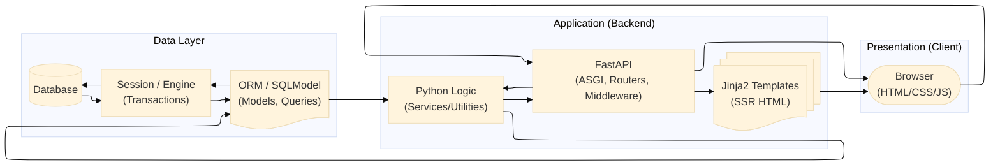

# FastAPI User Development - Local Web

---
```bash
This FastAPI project manages users, serving HTML pages with Jinja2.
Implements basic CRUD operations, and providing user filtering option.
```
---
## Install dependencies
```bash
- Python ≥ 3.9
```
```bash
pip install -r requirements.txt
```
---
## Run the server
### Option A — Without downloading (build directly from GitHub)
```bash
docker build -t details-share-api:latest https://github.com/RanWeissman/Details_Share_API.git#main
```
```bash
docker run --rm -p 8000:8000 details-share-api:latest
```

### Option B — With clone the project: 
```bash
git clone https://github.com/RanWeissman/Details_Share_API.git
```
```bash
cd Details_Share_API
```
```bash
docker compose up --build
```
### Option C — Without Docker, run locally: 
```bash
git clone https://github.com/RanWeissman/Details_Share_API.git
```
```bash
cd Details_Share_API
```
```bash
py -m pip install -r requirements.txt
```
```bash
py -m src.run_server
```
The server will start on: <http://127.0.0.1:8000>




